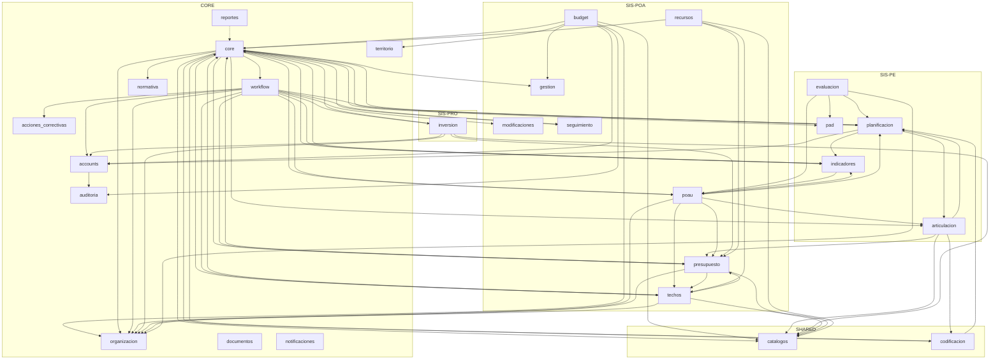
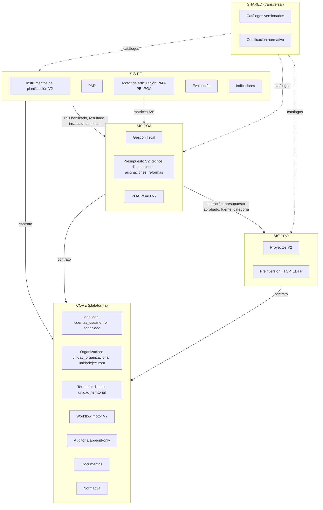

# Mapa de Dependencias

Grafo de dependencias reales del PIP-GAMS según auditoría (2026-08-16). Se distingue: dependencias correctas (hacia dominios estables), cruzadas (dominio de negocio leyendo/escribiendo modelos ajenos), inversas (core dependido por dominios) y ciclos latentes. Todos los datos: [CONFIRMADO] por auditoría.

## 1. Grafo de dependencias entre apps (AS-IS)

Nota: la flecha `C --> ...` (core → planificacion/presupuesto/poau/pad/articulacion/...) representa acceso de core a modelos de negocio (core/dashboard, core/validators); junto con las flechas entrantes forma el **ciclo latente core↔dominios** (hallazgo H-2.1).

## 2. Hubs y dependencias críticas

| Hub | Dirección | Naturaleza | Riesgo |
|---|---|---|---|
| reportes | lee de casi todas | hub de lectura | cualquier cambio de esquema ajeno rompe reportes [CONFIRMADO] |
| budget | dependiente de 7 apps (gestion, catalogos, auditoria, organizacion, territorio, accounts, core) | dependencias correctas hacia CORE/SHARED | modelo sano pero monolitos de código |
| workflow | dependiente de 11 apps de negocio | acoplamiento amplio | cambio en cualquier flujo afecta |
| articulacion | dependiente de codificacion, presupuesto, catalogos, planificacion | motor de integración | strings que duplican catálogos |
| core | dependido por todo Y dependiente de negocio | ciclo latente | acoplamiento bidireccional; validators.py:119 roto |

## 3. Diagrama de dominios TO-BE (objetivo)

## 4. Acceso directo a modelos ajenos (AS-IS)

| Origen | Destino | Evidencia | Correcto |
|---|---|---|---|
| core | pad (PlanAnual inexistente) | core/validators.py:119 | NO — roto |
| core | planificacion, presupuesto, poau, articulacion, indicadores, techos, seguimiento... | dashboard/validators en core | NO — ciclo latente |
| workflow | 11 apps | dependencias declaradas | NO — acoplamiento amplio |
| reportes | todas | hub de lectura | PARCIAL — lectura directa |
| articulacion | codificacion, presupuesto, catalogos | motor | SÍ — es su rol |

## 5. Apps limpias (solo core)

acciones_correctivas, documentos, gestion, modificaciones, normativa, notificaciones, organizacion, seguimiento, territorio: dependen únicamente de core. [CONFIRMADO]

## 6. Imports profundos y ciclos

- Ciclo latente: `core → planificacion → articulacion → codificacion → core` y variantes (core → presupuesto → techos → core). [INFERIDO a partir de las dependencias declaradas; verificación de import-time pendiente]
- Imports profundos: budget services (~2100 líneas) importando 7 apps; workflow imports multi-app. [CONFIRMADO]

## Referencias

- `docs/refactor-pip/DOMAIN_MAP.md` — mapa de dominios del refactor.
- `docs/refactor-pip/ARQUITECTURA_ACTUAL.md`, `docs/refactor-pip/ARQUITECTURA_OBJETIVO.md`.
- `docs/refactor-pip/ADR/ADR-009-modular-monolith.md`, `ADR-002-sis-poa-bounded-context.md`.
- `docs/pip_gams/domain_map.md`.
- `docs/architecture/DATA_OWNERSHIP.md`, `docs/architecture/DOMAIN_BOUNDARIES.md`, `docs/architecture/PIP_SYSTEM_MAP.md`.

Documento de gobernanza — creado en bootstrap ETAPA B (2026-08-16). No reemplaza a docs/refactor-pip/*; los complementa.
