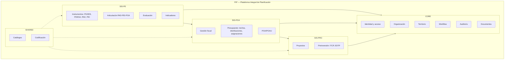

# PIP System Map — Arquitectura Objetivo (TO-BE)

Mapa conceptual del PIP: Plataforma Integral de Planificación (GAM Sacaba). TO-BE normativo; el AS-IS se documenta en `AS_IS_ARCHITECTURE.md` y `DEPENDENCY_MAP.md`.

## 1. El mapa

## 2. Responsabilidades por dominio

| Dominio | Responsabilidad | Entidades núcleo |
|---|---|---|
| CORE | Identidad, organización, territorio, workflow, documentos, auditoría, notificaciones, normativa | cuentas_usuario, unidad_organizacional, flujo_*_motor, evento_auditoria |
| SHARED | Catálogos versionados y codificación normativa | catalogo_*, codificacion_* |
| SIS-PE | Planificación estratégica: PGDES/PDESA, PAD, PEI, instrumentos, articulación, evaluación, indicadores | instrumento_planificacion, pad_*, articulacion_* |
| SIS-POA | Planificación operativa: POA/POAU, presupuesto, techos, distribuciones, asignaciones, seguimiento | gestion_fiscal, presupuesto_*, poau_* |
| SIS-PRO | Ciclo del proyecto: cartera, preinversión ITCP/EDTP, ejecución | proyecto, itcp, edtp |

## 3. Bounded contexts y ownership

- Un dominio es **OWNER** de sus tablas: nadie más escribe directamente; los demás leen vía contrato (Application service → Contrato → otro dominio).
- **Regla de integración**: `Dominio A → Application service de A → Contrato (serializado) → Application service de B → modelo de B`. Prohibido importar modelos de otro dominio fuera de un contrato explícito.
- **Regla CORE**: `CORE ← SIS-PE`, `CORE ← SIS-POA`, `CORE ← SIS-PRO`. CORE no depende de lógica de negocio de los sistemas (cambio respecto al ciclo latente actual).
- **SHARED es transversal**: catálogos y codificación los leen todos; solo SHARED los escribe.

## 4. Relaciones permitidas (TO-BE)

| Origen | Destino | Concepto |
|---|---|---|
| SIS-PE | SIS-POA | PEI habilitado, resultado institucional, acción institucional, indicador/meta, articulación PAD-PEI-POA |
| SIS-POA | SIS-PRO | operación, proyecto, unidad ejecutora, presupuesto aprobado, fuente, categoría programática |
| SIS-PE/SIS-POA/SIS-PRO | CORE | identidad, unidad, territorio, workflow, auditoría |
| Cualquiera | SHARED | lectura de catálogos/codificación |

## 5. Cadena principal de articulación

`PEI → POA → POAU → presupuesto → SIS-PRO`

- SIS-PE produce instrumentos y articulación (matrices A/B).
- SIS-POA consume resultados institucionales para programar operaciones/actividades y presupuestarlas (techos → distribuciones → asignaciones).
- SIS-PRO consume operaciones y presupuesto aprobado para financiar proyectos.

## 6. AS-IS vs TO-BE

| Aspecto | AS-IS | TO-BE |
|---|---|---|
| Integración | imports directos entre apps, FKs genéricas, strings | contratos explícitos por dominio |
| core | depende de negocio (ciclo latente) | solo plataforma (no depende de negocio) |
| Cadenas operativas | ×4 duplicadas | única canónica (poau V2) |
| Catálogos | duplicados por strings en 4 apps | solo SHARED |
| V1/V2 | convivencia total, frontend en V1 | V2 único tras Sunset 2027-01-01 |

## 7. Guías normativas

- Límites finos: `DOMAIN_BOUNDARIES.md`
- Ownership por concepto: `DATA_OWNERSHIP.md`
- Contratos de integración: `INTEGRATION_CONTRACTS.md`

## Referencias

- `docs/refactor-pip/ARQUITECTURA_OBJETIVO.md`, `docs/refactor-pip/DOMAIN_MAP.md`.
- `docs/refactor-pip/ADR/ADR-001-pip-root-platform.md`, `ADR-002-sis-poa-bounded-context.md`, `ADR-004-articulation-model.md`, `ADR-009-modular-monolith.md`.
- `docs/pip_gams/domain_map.md`, `docs/pip_gams/README.md`.
- `docs/refactor-pip/SIS_PE_BOUNDED_CONTEXT.md`, `SIS_POA_BOUNDED_CONTEXT.md`, `SIS_PRO_BOUNDED_CONTEXT.md`, `PIP_INTEGRACION_BOUNDED_CONTEXT.md`.

Documento de gobernanza — creado en bootstrap ETAPA B (2026-08-16). No reemplaza a docs/refactor-pip/*; los complementa.
