# Diagrama de Entidad-Relacion — SISPAD-PEI-POA

Este documento presenta el modelo de datos completo del sistema, con todas las entidades agrupadas por modulo/aplicacion y sus relaciones representadas en sintaxis Mermaid ER.

## Vista General

El sistema contiene **80+ entidades** distribuidas en **24 aplicaciones Django**. Las relaciones incluyen ForeignKey (FK), ManyToMany (M2M) y OneToOne.

---

## 1. Modulo Accounts (Cuentas y Roles)

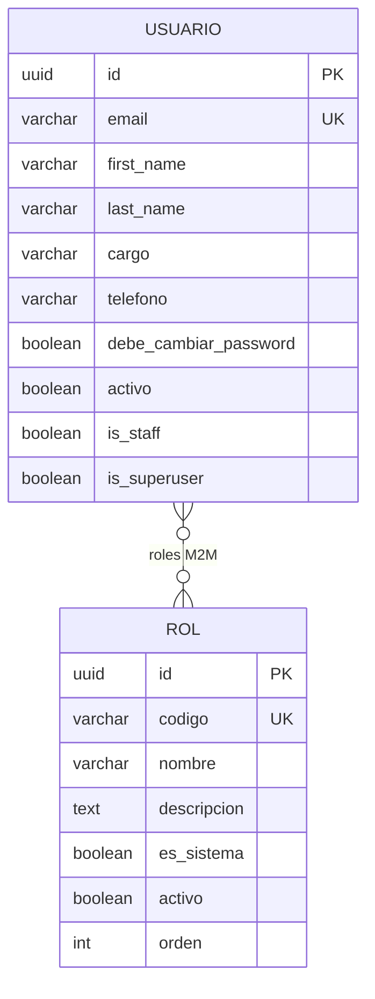
```mermaid
erDiagram
    ROL {
        uuid id PK
        varchar codigo UK
        varchar nombre
        text descripcion
        boolean es_sistema
        boolean activo
        int orden
    }

    USUARIO {
        uuid id PK
        varchar email UK
        varchar first_name
        varchar last_name
        varchar cargo
        varchar telefono
        boolean debe_cambiar_password
        boolean activo
        boolean is_staff
        boolean is_superuser
    }

    USUARIO }o--o{ ROL : "roles M2M"
```

---

## 2. Modulo Organizacion (Estructura Institucional)

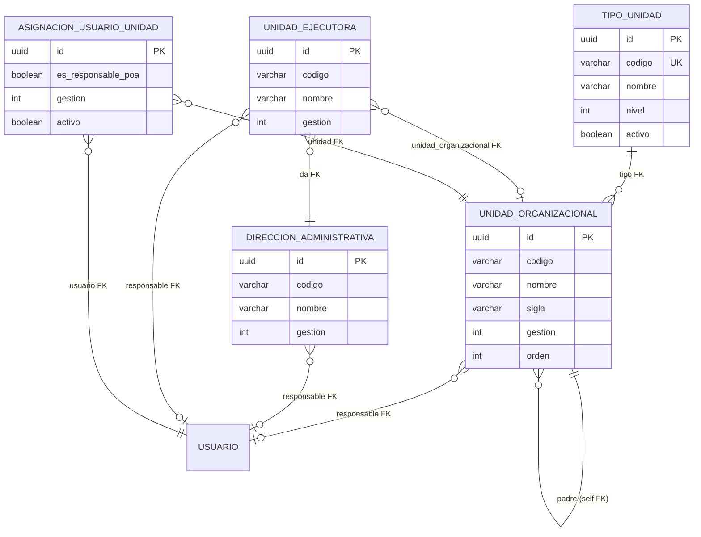
```mermaid
erDiagram
    TIPO_UNIDAD {
        uuid id PK
        varchar codigo UK
        varchar nombre
        int nivel
        boolean activo
    }

    UNIDAD_ORGANIZACIONAL {
        uuid id PK
        varchar codigo
        varchar nombre
        varchar sigla
        int gestion
        int orden
    }

    DIRECCION_ADMINISTRATIVA {
        uuid id PK
        varchar codigo
        varchar nombre
        int gestion
    }

    UNIDAD_EJECUTORA {
        uuid id PK
        varchar codigo
        varchar nombre
        int gestion
    }

    ASIGNACION_USUARIO_UNIDAD {
        uuid id PK
        boolean es_responsable_poa
        int gestion
        boolean activo
    }

    TIPO_UNIDAD ||--o{ UNIDAD_ORGANIZACIONAL : "tipo FK"
    UNIDAD_ORGANIZACIONAL ||--o{ UNIDAD_ORGANIZACIONAL : "padre (self FK)"
    UNIDAD_ORGANIZACIONAL }o--o| USUARIO : "responsable FK"
    DIRECCION_ADMINISTRATIVA }o--o| USUARIO : "responsable FK"
    UNIDAD_EJECUTORA }o--|| DIRECCION_ADMINISTRATIVA : "da FK"
    UNIDAD_EJECUTORA }o--o| UNIDAD_ORGANIZACIONAL : "unidad_organizacional FK"
    UNIDAD_EJECUTORA }o--o| USUARIO : "responsable FK"
    ASIGNACION_USUARIO_UNIDAD }o--|| USUARIO : "usuario FK"
    ASIGNACION_USUARIO_UNIDAD }o--|| UNIDAD_ORGANIZACIONAL : "unidad FK"
```

---

## 3. Modulo Gestion (Gestion Fiscal y Ciclos)

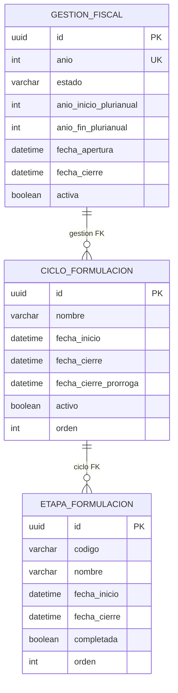
```mermaid
erDiagram
    GESTION_FISCAL {
        uuid id PK
        int anio UK
        varchar estado
        int anio_inicio_plurianual
        int anio_fin_plurianual
        datetime fecha_apertura
        datetime fecha_cierre
        boolean activa
    }

    CICLO_FORMULACION {
        uuid id PK
        varchar nombre
        datetime fecha_inicio
        datetime fecha_cierre
        datetime fecha_cierre_prorroga
        boolean activo
        int orden
    }

    ETAPA_FORMULACION {
        uuid id PK
        varchar codigo
        varchar nombre
        datetime fecha_inicio
        datetime fecha_cierre
        boolean completada
        int orden
    }

    GESTION_FISCAL ||--o{ CICLO_FORMULACION : "gestion FK"
    CICLO_FORMULACION ||--o{ ETAPA_FORMULACION : "ciclo FK"
```

---

## 4. Modulo Catalogos (Clasificadores Presupuestarios)

```mermaid
erDiagram
    CATALOGO_BASE {
        uuid id PK
        varchar codigo
        varchar denominacion
        text descripcion
        int gestion
        varchar fuente_normativa
    }

    CLASIFICADOR_INSTITUCIONAL {
        uuid id PK
    }

    RUBRO_RECURSO {
        uuid id PK
    }

    OBJETO_GASTO {
        uuid id PK
    }

    FUENTE_FINANCIAMIENTO {
        uuid id PK
    }

    ORGANISMO_FINANCIADOR {
        uuid id PK
    }

    ENTIDAD_TRANSFERENCIA {
        uuid id PK
    }

    FINALIDAD_FUNCION {
        uuid id PK
    }

    UNIDAD_MEDIDA {
        uuid id PK
    }

    TIPO_OPERACION {
        uuid id PK
    }

    TIPO_PRODUCTO {
        uuid id PK
    }

    TIPO_PROYECTO {
        uuid id PK
    }

    TIPO_FINANCIAMIENTO {
        uuid id PK
    }

    VERSION_CATALOGO {
        uuid id PK
        varchar nombre
        int gestion
        boolean aplicado
    }

    CATALOGO_BASE ||--o| CLASIFICADOR_INSTITUCIONAL : "hereda"
    CATALOGO_BASE ||--o| RUBRO_RECURSO : "hereda"
    CATALOGO_BASE ||--o| OBJETO_GASTO : "hereda"
    CATALOGO_BASE ||--o| FUENTE_FINANCIAMIENTO : "hereda"
    CATALOGO_BASE ||--o| ORGANISMO_FINANCIADOR : "hereda"
    CATALOGO_BASE ||--o| ENTIDAD_TRANSFERENCIA : "hereda"
    CATALOGO_BASE ||--o| FINALIDAD_FUNCION : "hereda"
    CATALOGO_BASE ||--o| UNIDAD_MEDIDA : "hereda"
    CATALOGO_BASE ||--o| TIPO_OPERACION : "hereda"
    CATALOGO_BASE ||--o| TIPO_PRODUCTO : "hereda"
    CATALOGO_BASE ||--o| TIPO_PROYECTO : "hereda"
    CATALOGO_BASE ||--o| TIPO_FINANCIAMIENTO : "hereda"
```

---

## 5. Modulo Planificacion (Planes Estrategicos)

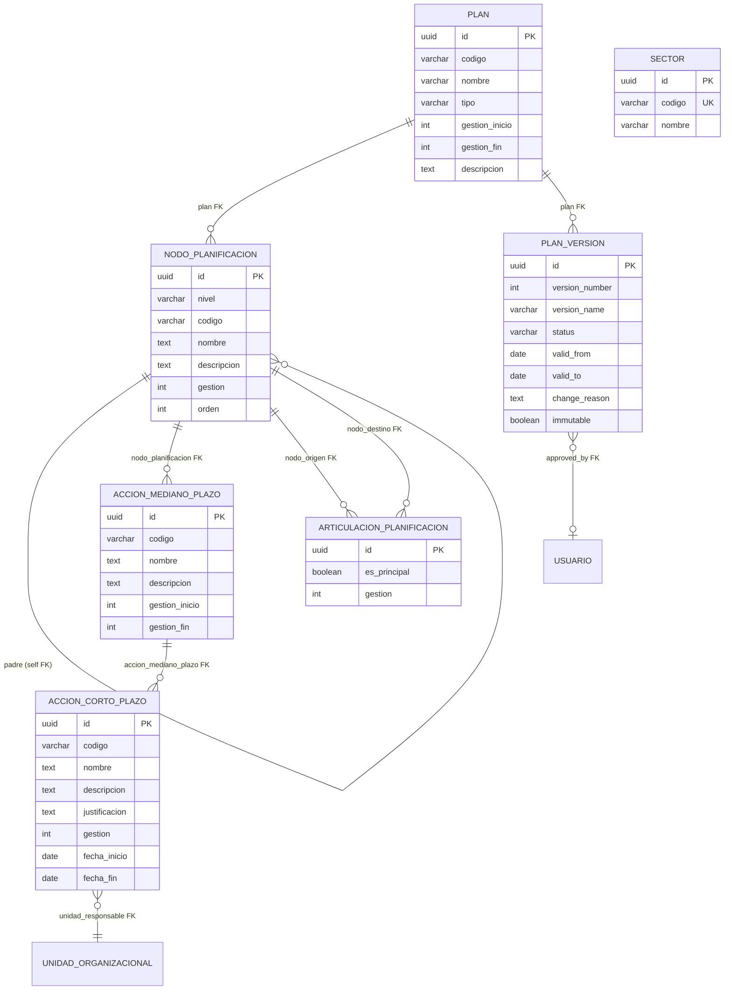
```mermaid
erDiagram
    PLAN {
        uuid id PK
        varchar codigo
        varchar nombre
        varchar tipo
        int gestion_inicio
        int gestion_fin
        text descripcion
    }

    SECTOR {
        uuid id PK
        varchar codigo UK
        varchar nombre
    }

    NODO_PLANIFICACION {
        uuid id PK
        varchar nivel
        varchar codigo
        text nombre
        text descripcion
        int gestion
        int orden
    }

    ACCION_MEDIANO_PLAZO {
        uuid id PK
        varchar codigo
        text nombre
        text descripcion
        int gestion_inicio
        int gestion_fin
    }

    ACCION_CORTO_PLAZO {
        uuid id PK
        varchar codigo
        text nombre
        text descripcion
        text justificacion
        int gestion
        date fecha_inicio
        date fecha_fin
    }

    ARTICULACION_PLANIFICACION {
        uuid id PK
        boolean es_principal
        int gestion
    }

    PLAN_VERSION {
        uuid id PK
        int version_number
        varchar version_name
        varchar status
        date valid_from
        date valid_to
        text change_reason
        boolean immutable
    }

    PLAN ||--o{ NODO_PLANIFICACION : "plan FK"
    NODO_PLANIFICACION ||--o{ NODO_PLANIFICACION : "padre (self FK)"
    NODO_PLANIFICACION ||--o{ ACCION_MEDIANO_PLAZO : "nodo_planificacion FK"
    ACCION_MEDIANO_PLAZO ||--o{ ACCION_CORTO_PLAZO : "accion_mediano_plazo FK"
    ACCION_CORTO_PLAZO }o--|| UNIDAD_ORGANIZACIONAL : "unidad_responsable FK"
    NODO_PLANIFICACION ||--o{ ARTICULACION_PLANIFICACION : "nodo_origen FK"
    NODO_PLANIFICACION ||--o{ ARTICULACION_PLANIFICACION : "nodo_destino FK"
    PLAN ||--o{ PLAN_VERSION : "plan FK"
    PLAN_VERSION }o--o| USUARIO : "approved_by FK"
```

---

## 6. Modulo Indicadores (Indicadores, Metas, Operaciones)

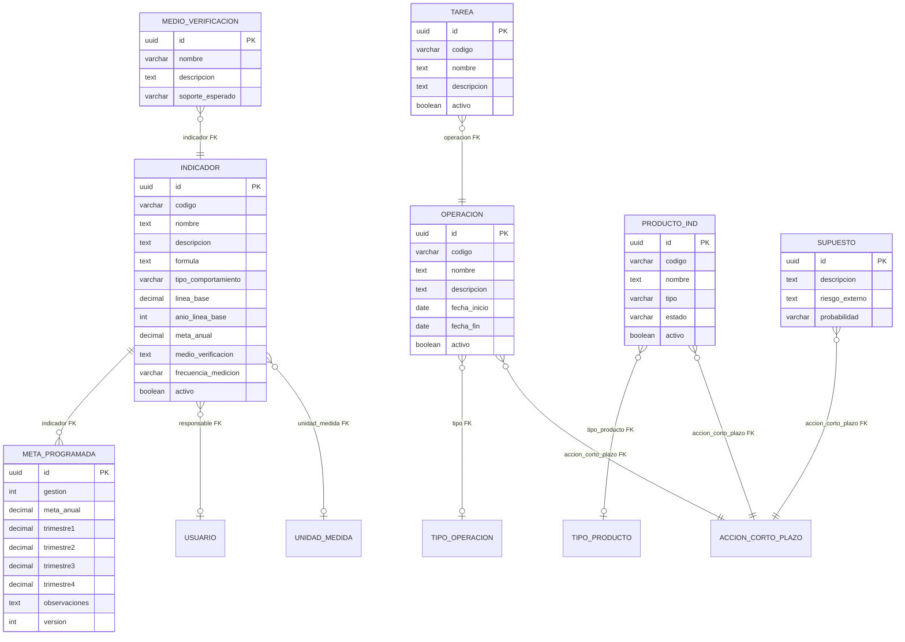
```mermaid
erDiagram
    INDICADOR {
        uuid id PK
        varchar codigo
        text nombre
        text descripcion
        text formula
        varchar tipo_comportamiento
        decimal linea_base
        int anio_linea_base
        decimal meta_anual
        text medio_verificacion
        varchar frecuencia_medicion
        boolean activo
    }

    META_PROGRAMADA {
        uuid id PK
        int gestion
        decimal meta_anual
        decimal trimestre1
        decimal trimestre2
        decimal trimestre3
        decimal trimestre4
        text observaciones
        int version
    }

    OPERACION {
        uuid id PK
        varchar codigo
        text nombre
        text descripcion
        date fecha_inicio
        date fecha_fin
        boolean activo
    }

    TAREA {
        uuid id PK
        varchar codigo
        text nombre
        text descripcion
        boolean activo
    }

    PRODUCTO_IND {
        uuid id PK
        varchar codigo
        text nombre
        varchar tipo
        varchar estado
        boolean activo
    }

    MEDIO_VERIFICACION {
        uuid id PK
        varchar nombre
        text descripcion
        varchar soporte_esperado
    }

    SUPUESTO {
        uuid id PK
        text descripcion
        text riesgo_externo
        varchar probabilidad
    }

    INDICADOR }o--o| UNIDAD_MEDIDA : "unidad_medida FK"
    INDICADOR }o--o| USUARIO : "responsable FK"
    INDICADOR ||--o{ META_PROGRAMADA : "indicador FK"
    OPERACION }o--|| ACCION_CORTO_PLAZO : "accion_corto_plazo FK"
    OPERACION }o--o| TIPO_OPERACION : "tipo FK"
    TAREA }o--|| OPERACION : "operacion FK"
    PRODUCTO_IND }o--|| ACCION_CORTO_PLAZO : "accion_corto_plazo FK"
    PRODUCTO_IND }o--o| TIPO_PRODUCTO : "tipo_producto FK"
    MEDIO_VERIFICACION }o--|| INDICADOR : "indicador FK"
    SUPUESTO }o--|| ACCION_CORTO_PLAZO : "accion_corto_plazo FK"
```

---

## 7. Modulo Recursos (Estimacion de Recursos)

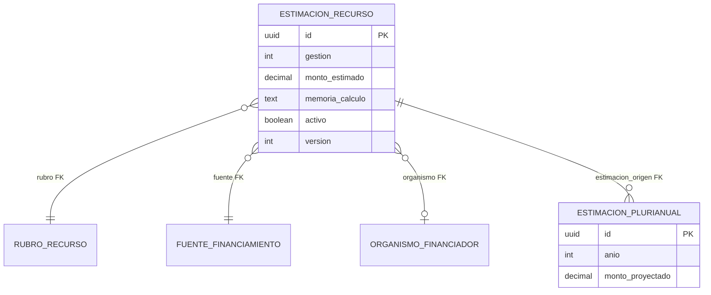
```mermaid
erDiagram
    ESTIMACION_RECURSO {
        uuid id PK
        int gestion
        decimal monto_estimado
        text memoria_calculo
        boolean activo
        int version
    }

    ESTIMACION_PLURIANUAL {
        uuid id PK
        int anio
        decimal monto_proyectado
    }

    ESTIMACION_RECURSO }o--|| RUBRO_RECURSO : "rubro FK"
    ESTIMACION_RECURSO }o--|| FUENTE_FINANCIAMIENTO : "fuente FK"
    ESTIMACION_RECURSO }o--o| ORGANISMO_FINANCIADOR : "organismo FK"
    ESTIMACION_RECURSO ||--o{ ESTIMACION_PLURIANUAL : "estimacion_origen FK"
```

---

## 8. Modulo Techos (Techos Presupuestarios)

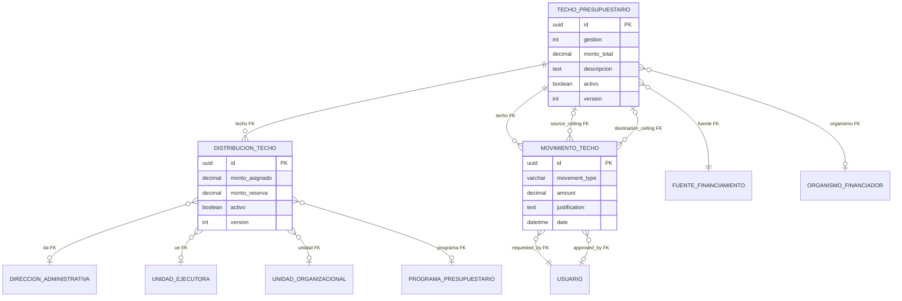
```mermaid
erDiagram
    TECHO_PRESUPUESTARIO {
        uuid id PK
        int gestion
        decimal monto_total
        text descripcion
        boolean activo
        int version
    }

    DISTRIBUCION_TECHO {
        uuid id PK
        decimal monto_asignado
        decimal monto_reserva
        boolean activo
        int version
    }

    MOVIMIENTO_TECHO {
        uuid id PK
        varchar movement_type
        decimal amount
        text justification
        datetime date
    }

    TECHO_PRESUPUESTARIO }o--|| FUENTE_FINANCIAMIENTO : "fuente FK"
    TECHO_PRESUPUESTARIO }o--o| ORGANISMO_FINANCIADOR : "organismo FK"
    TECHO_PRESUPUESTARIO ||--o{ DISTRIBUCION_TECHO : "techo FK"
    DISTRIBUCION_TECHO }o--o| DIRECCION_ADMINISTRATIVA : "da FK"
    DISTRIBUCION_TECHO }o--o| UNIDAD_EJECUTORA : "ue FK"
    DISTRIBUCION_TECHO }o--o| UNIDAD_ORGANIZACIONAL : "unidad FK"
    DISTRIBUCION_TECHO }o--o| PROGRAMA_PRESUPUESTARIO : "programa FK"
    TECHO_PRESUPUESTARIO ||--o{ MOVIMIENTO_TECHO : "techo FK"
    MOVIMIENTO_TECHO }o--o| TECHO_PRESUPUESTARIO : "source_ceiling FK"
    MOVIMIENTO_TECHO }o--o| TECHO_PRESUPUESTARIO : "destination_ceiling FK"
    MOVIMIENTO_TECHO }o--|| USUARIO : "requested_by FK"
    MOVIMIENTO_TECHO }o--o| USUARIO : "approved_by FK"
```

---

## 9. Modulo Presupuesto (Llave Presupuestaria)

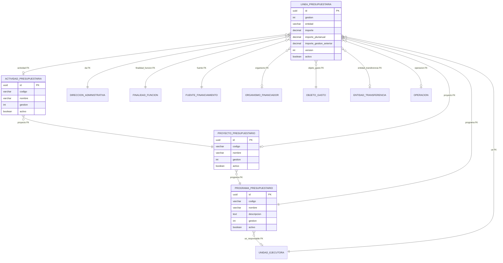
```mermaid
erDiagram
    PROGRAMA_PRESUPUESTARIO {
        uuid id PK
        varchar codigo
        varchar nombre
        text descripcion
        int gestion
        boolean activo
    }

    PROYECTO_PRESUPUESTARIO {
        uuid id PK
        varchar codigo
        varchar nombre
        int gestion
        boolean activo
    }

    ACTIVIDAD_PRESUPUESTARIA {
        uuid id PK
        varchar codigo
        varchar nombre
        int gestion
        boolean activo
    }

    LINEA_PRESUPUESTARIA {
        uuid id PK
        int gestion
        varchar entidad
        decimal importe
        decimal importe_plurianual
        decimal importe_gestion_anterior
        int version
        boolean activo
    }

    PROGRAMA_PRESUPUESTARIO }o--o| UNIDAD_EJECUTORA : "ue_responsable FK"
    PROYECTO_PRESUPUESTARIO }o--|| PROGRAMA_PRESUPUESTARIO : "programa FK"
    ACTIVIDAD_PRESUPUESTARIA }o--|| PROYECTO_PRESUPUESTARIO : "proyecto FK"
    LINEA_PRESUPUESTARIA }o--|| DIRECCION_ADMINISTRATIVA : "da FK"
    LINEA_PRESUPUESTARIA }o--|| UNIDAD_EJECUTORA : "ue FK"
    LINEA_PRESUPUESTARIA }o--|| PROGRAMA_PRESUPUESTARIO : "programa FK"
    LINEA_PRESUPUESTARIA }o--o| PROYECTO_PRESUPUESTARIO : "proyecto FK"
    LINEA_PRESUPUESTARIA }o--o| ACTIVIDAD_PRESUPUESTARIA : "actividad FK"
    LINEA_PRESUPUESTARIA }o--|| FINALIDAD_FUNCION : "finalidad_funcion FK"
    LINEA_PRESUPUESTARIA }o--|| FUENTE_FINANCIAMIENTO : "fuente FK"
    LINEA_PRESUPUESTARIA }o--o| ORGANISMO_FINANCIADOR : "organismo FK"
    LINEA_PRESUPUESTARIA }o--|| OBJETO_GASTO : "objeto_gasto FK"
    LINEA_PRESUPUESTARIA }o--o| ENTIDAD_TRANSFERENCIA : "entidad_transferencia FK"
    LINEA_PRESUPUESTARIA }o--o| OPERACION : "operacion FK"
```

---

## 10. Modulo Inversion (Proyectos de Inversion)

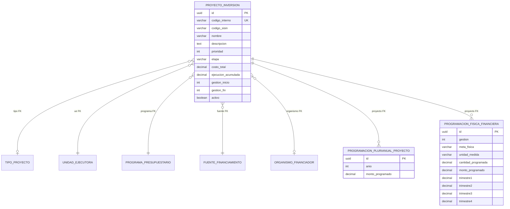
```mermaid
erDiagram
    PROYECTO_INVERSION {
        uuid id PK
        varchar codigo_interno UK
        varchar codigo_sisin
        varchar nombre
        text descripcion
        int prioridad
        varchar etapa
        decimal costo_total
        decimal ejecucion_acumulada
        int gestion_inicio
        int gestion_fin
        boolean activo
    }

    PROGRAMACION_PLURIANUAL_PROYECTO {
        uuid id PK
        int anio
        decimal monto_programado
    }

    PROGRAMACION_FISICA_FINANCIERA {
        uuid id PK
        int gestion
        varchar meta_fisica
        varchar unidad_medida
        decimal cantidad_programada
        decimal monto_programado
        decimal trimestre1
        decimal trimestre2
        decimal trimestre3
        decimal trimestre4
    }

    PROYECTO_INVERSION }o--o| TIPO_PROYECTO : "tipo FK"
    PROYECTO_INVERSION }o--|| UNIDAD_EJECUTORA : "ue FK"
    PROYECTO_INVERSION }o--|| PROGRAMA_PRESUPUESTARIO : "programa FK"
    PROYECTO_INVERSION }o--|| FUENTE_FINANCIAMIENTO : "fuente FK"
    PROYECTO_INVERSION }o--o| ORGANISMO_FINANCIADOR : "organismo FK"
    PROYECTO_INVERSION ||--o{ PROGRAMACION_PLURIANUAL_PROYECTO : "proyecto FK"
    PROYECTO_INVERSION ||--o{ PROGRAMACION_FISICA_FINANCIERA : "proyecto FK"
```

---

## 11. Modulo Territorio (Datos Geoespaciales)

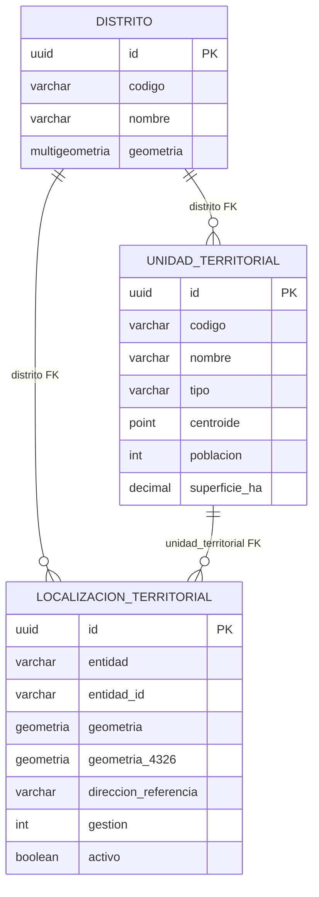
```mermaid
erDiagram
    DISTRITO {
        uuid id PK
        varchar codigo
        varchar nombre
        multigeometria geometria
    }

    UNIDAD_TERRITORIAL {
        uuid id PK
        varchar codigo
        varchar nombre
        varchar tipo
        point centroide
        int poblacion
        decimal superficie_ha
    }

    LOCALIZACION_TERRITORIAL {
        uuid id PK
        varchar entidad
        varchar entidad_id
        geometria geometria
        geometria geometria_4326
        varchar direccion_referencia
        int gestion
        boolean activo
    }

    DISTRITO ||--o{ UNIDAD_TERRITORIAL : "distrito FK"
    DISTRITO ||--o{ LOCALIZACION_TERRITORIAL : "distrito FK"
    UNIDAD_TERRITORIAL ||--o{ LOCALIZACION_TERRITORIAL : "unidad_territorial FK"
```

---

## 12. Modulo PAD (Plan Anual de Desarrollo)

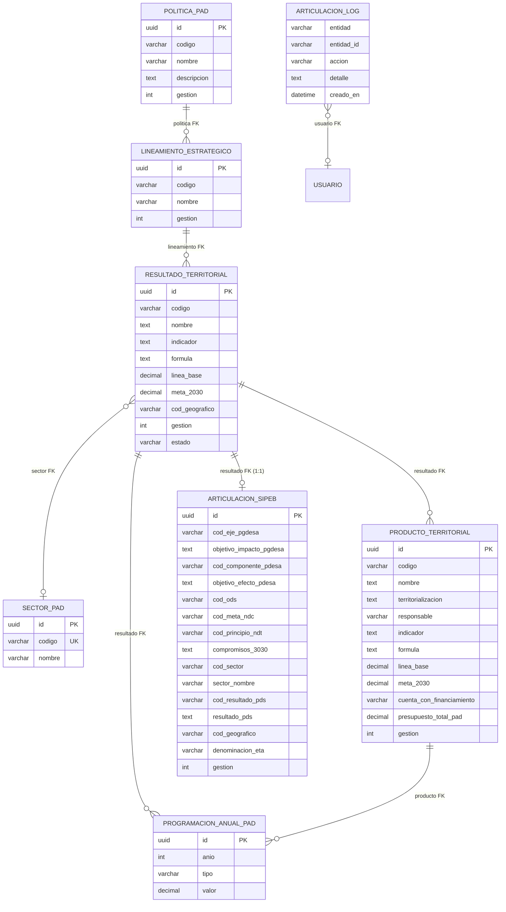
```mermaid
erDiagram
    SECTOR_PAD {
        uuid id PK
        varchar codigo UK
        varchar nombre
    }

    POLITICA_PAD {
        uuid id PK
        varchar codigo
        varchar nombre
        text descripcion
        int gestion
    }

    LINEAMIENTO_ESTRATEGICO {
        uuid id PK
        varchar codigo
        varchar nombre
        int gestion
    }

    RESULTADO_TERRITORIAL {
        uuid id PK
        varchar codigo
        text nombre
        text indicador
        text formula
        decimal linea_base
        decimal meta_2030
        varchar cod_geografico
        int gestion
        varchar estado
    }

    PRODUCTO_TERRITORIAL {
        uuid id PK
        varchar codigo
        text nombre
        text territorializacion
        varchar responsable
        text indicador
        text formula
        decimal linea_base
        decimal meta_2030
        varchar cuenta_con_financiamiento
        decimal presupuesto_total_pad
        int gestion
    }

    PROGRAMACION_ANUAL_PAD {
        uuid id PK
        int anio
        varchar tipo
        decimal valor
    }

    ARTICULACION_SIPEB {
        uuid id PK
        varchar cod_eje_pgdesa
        text objetivo_impacto_pgdesa
        varchar cod_componente_pdesa
        text objetivo_efecto_pdesa
        varchar cod_ods
        varchar cod_meta_ndc
        varchar cod_principio_ndt
        text compromisos_3030
        varchar cod_sector
        varchar sector_nombre
        varchar cod_resultado_pds
        text resultado_pds
        varchar cod_geografico
        varchar denominacion_eta
        int gestion
    }

    ARTICULACION_LOG {
        varchar entidad
        varchar entidad_id
        varchar accion
        text detalle
        datetime creado_en
    }

    POLITICA_PAD ||--o{ LINEAMIENTO_ESTRATEGICO : "politica FK"
    LINEAMIENTO_ESTRATEGICO ||--o{ RESULTADO_TERRITORIAL : "lineamiento FK"
    RESULTADO_TERRITORIAL }o--o| SECTOR_PAD : "sector FK"
    RESULTADO_TERRITORIAL ||--o{ PRODUCTO_TERRITORIAL : "resultado FK"
    RESULTADO_TERRITORIAL ||--o{ PROGRAMACION_ANUAL_PAD : "resultado FK"
    PRODUCTO_TERRITORIAL ||--o{ PROGRAMACION_ANUAL_PAD : "producto FK"
    RESULTADO_TERRITORIAL ||--o| ARTICULACION_SIPEB : "resultado FK (1:1)"
    ARTICULACION_LOG }o--o| USUARIO : "usuario FK"
```

---

## 13. Modulo POAU (Plan Operativo Anual por Unidad)

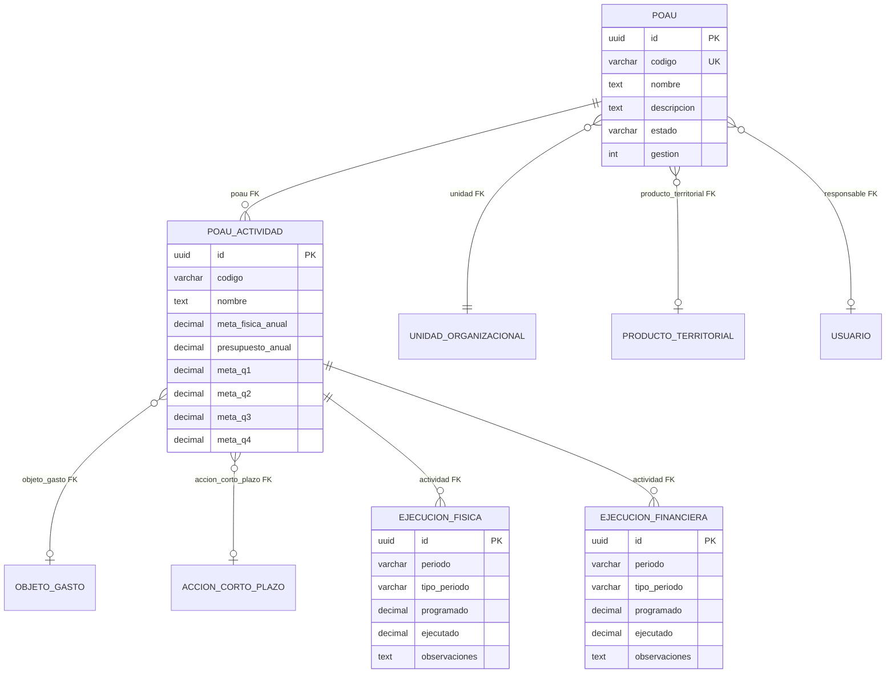
```mermaid
erDiagram
    POAU {
        uuid id PK
        varchar codigo UK
        text nombre
        text descripcion
        varchar estado
        int gestion
    }

    POAU_ACTIVIDAD {
        uuid id PK
        varchar codigo
        text nombre
        decimal meta_fisica_anual
        decimal presupuesto_anual
        decimal meta_q1
        decimal meta_q2
        decimal meta_q3
        decimal meta_q4
    }

    EJECUCION_FISICA {
        uuid id PK
        varchar periodo
        varchar tipo_periodo
        decimal programado
        decimal ejecutado
        text observaciones
    }

    EJECUCION_FINANCIERA {
        uuid id PK
        varchar periodo
        varchar tipo_periodo
        decimal programado
        decimal ejecutado
        text observaciones
    }

    POAU }o--|| UNIDAD_ORGANIZACIONAL : "unidad FK"
    POAU }o--o| PRODUCTO_TERRITORIAL : "producto_territorial FK"
    POAU }o--o| USUARIO : "responsable FK"
    POAU ||--o{ POAU_ACTIVIDAD : "poau FK"
    POAU_ACTIVIDAD }o--o| OBJETO_GASTO : "objeto_gasto FK"
    POAU_ACTIVIDAD }o--o| ACCION_CORTO_PLAZO : "accion_corto_plazo FK"
    POAU_ACTIVIDAD ||--o{ EJECUCION_FISICA : "actividad FK"
    POAU_ACTIVIDAD ||--o{ EJECUCION_FINANCIERA : "actividad FK"
```

---

## 14. Modulo Workflow (Flujo de Aprobacion)

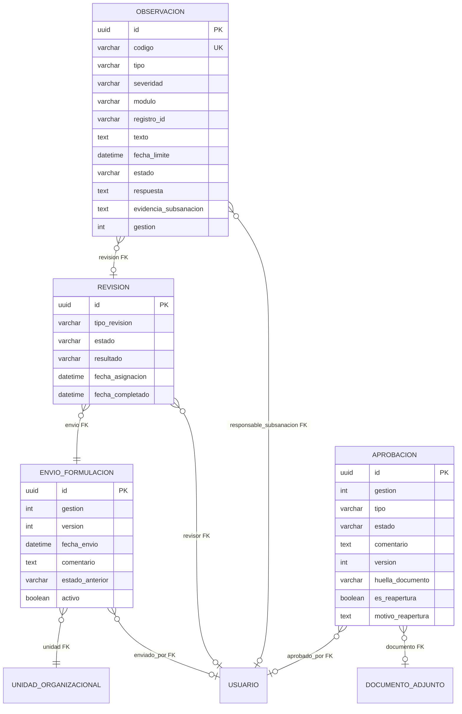
```mermaid
erDiagram
    ENVIO_FORMULACION {
        uuid id PK
        int gestion
        int version
        datetime fecha_envio
        text comentario
        varchar estado_anterior
        boolean activo
    }

    REVISION {
        uuid id PK
        varchar tipo_revision
        varchar estado
        varchar resultado
        datetime fecha_asignacion
        datetime fecha_completado
    }

    OBSERVACION {
        uuid id PK
        varchar codigo UK
        varchar tipo
        varchar severidad
        varchar modulo
        varchar registro_id
        text texto
        datetime fecha_limite
        varchar estado
        text respuesta
        text evidencia_subsanacion
        int gestion
    }

    APROBACION {
        uuid id PK
        int gestion
        varchar tipo
        varchar estado
        text comentario
        int version
        varchar huella_documento
        boolean es_reapertura
        text motivo_reapertura
    }

    ENVIO_FORMULACION }o--|| UNIDAD_ORGANIZACIONAL : "unidad FK"
    ENVIO_FORMULACION }o--o| USUARIO : "enviado_por FK"
    REVISION }o--|| ENVIO_FORMULACION : "envio FK"
    REVISION }o--o| USUARIO : "revisor FK"
    OBSERVACION }o--o| REVISION : "revision FK"
    OBSERVACION }o--o| USUARIO : "responsable_subsanacion FK"
    APROBACION }o--o| USUARIO : "aprobado_por FK"
    APROBACION }o--o| DOCUMENTO_ADJUNTO : "documento FK"
```

---

## 15. Modulo Documentos (Archivos Adjuntos)

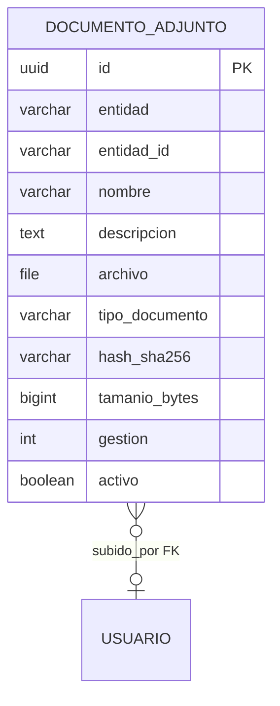
```mermaid
erDiagram
    DOCUMENTO_ADJUNTO {
        uuid id PK
        varchar entidad
        varchar entidad_id
        varchar nombre
        text descripcion
        file archivo
        varchar tipo_documento
        varchar hash_sha256
        bigint tamanio_bytes
        int gestion
        boolean activo
    }

    DOCUMENTO_ADJUNTO }o--o| USUARIO : "subido_por FK"
```

---

## 16. Modulo Evaluacion

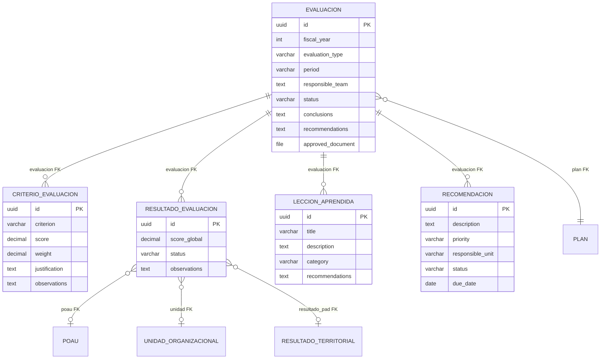
```mermaid
erDiagram
    EVALUACION {
        uuid id PK
        int fiscal_year
        varchar evaluation_type
        varchar period
        text responsible_team
        varchar status
        text conclusions
        text recommendations
        file approved_document
    }

    CRITERIO_EVALUACION {
        uuid id PK
        varchar criterion
        decimal score
        decimal weight
        text justification
        text observations
    }

    RESULTADO_EVALUACION {
        uuid id PK
        decimal score_global
        varchar status
        text observations
    }

    LECCION_APRENDIDA {
        uuid id PK
        varchar title
        text description
        varchar category
        text recommendations
    }

    RECOMENDACION {
        uuid id PK
        text description
        varchar priority
        varchar responsible_unit
        varchar status
        date due_date
    }

    EVALUACION }o--|| PLAN : "plan FK"
    EVALUACION ||--o{ CRITERIO_EVALUACION : "evaluacion FK"
    EVALUACION ||--o{ RESULTADO_EVALUACION : "evaluacion FK"
    EVALUACION ||--o{ LECCION_APRENDIDA : "evaluacion FK"
    EVALUACION ||--o{ RECOMENDACION : "evaluacion FK"
    RESULTADO_EVALUACION }o--o| POAU : "poau FK"
    RESULTADO_EVALUACION }o--o| UNIDAD_ORGANIZACIONAL : "unidad FK"
    RESULTADO_EVALUACION }o--o| RESULTADO_TERRITORIAL : "resultado_pad FK"
```

---

## 17. Modulo Seguimiento

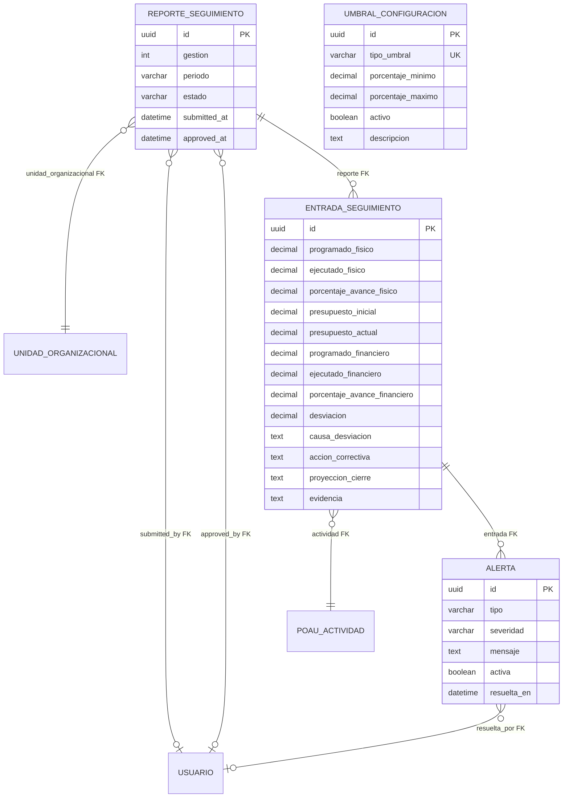
```mermaid
erDiagram
    REPORTE_SEGUIMIENTO {
        uuid id PK
        int gestion
        varchar periodo
        varchar estado
        datetime submitted_at
        datetime approved_at
    }

    ENTRADA_SEGUIMIENTO {
        uuid id PK
        decimal programado_fisico
        decimal ejecutado_fisico
        decimal porcentaje_avance_fisico
        decimal presupuesto_inicial
        decimal presupuesto_actual
        decimal programado_financiero
        decimal ejecutado_financiero
        decimal porcentaje_avance_financiero
        decimal desviacion
        text causa_desviacion
        text accion_correctiva
        text proyeccion_cierre
        text evidencia
    }

    ALERTA {
        uuid id PK
        varchar tipo
        varchar severidad
        text mensaje
        boolean activa
        datetime resuelta_en
    }

    UMBRAL_CONFIGURACION {
        uuid id PK
        varchar tipo_umbral UK
        decimal porcentaje_minimo
        decimal porcentaje_maximo
        boolean activo
        text descripcion
    }

    REPORTE_SEGUIMIENTO }o--|| UNIDAD_ORGANIZACIONAL : "unidad_organizacional FK"
    REPORTE_SEGUIMIENTO }o--o| USUARIO : "submitted_by FK"
    REPORTE_SEGUIMIENTO }o--o| USUARIO : "approved_by FK"
    REPORTE_SEGUIMIENTO ||--o{ ENTRADA_SEGUIMIENTO : "reporte FK"
    ENTRADA_SEGUIMIENTO }o--|| POAU_ACTIVIDAD : "actividad FK"
    ENTRADA_SEGUIMIENTO ||--o{ ALERTA : "entrada FK"
    ALERTA }o--o| USUARIO : "resuelta_por FK"
```

---

## 18. Modulo Acciones Correctivas

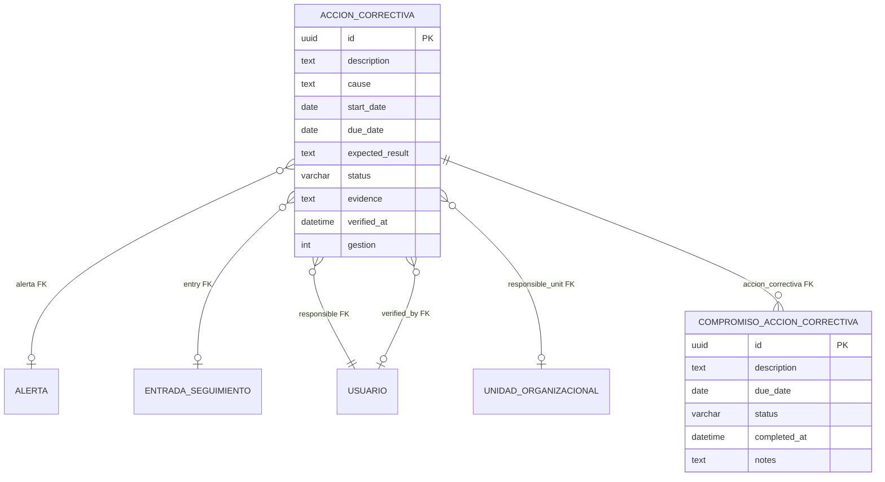
```mermaid
erDiagram
    ACCION_CORRECTIVA {
        uuid id PK
        text description
        text cause
        date start_date
        date due_date
        text expected_result
        varchar status
        text evidence
        datetime verified_at
        int gestion
    }

    COMPROMISO_ACCION_CORRECTIVA {
        uuid id PK
        text description
        date due_date
        varchar status
        datetime completed_at
        text notes
    }

    ACCION_CORRECTIVA }o--o| ALERTA : "alerta FK"
    ACCION_CORRECTIVA }o--o| ENTRADA_SEGUIMIENTO : "entry FK"
    ACCION_CORRECTIVA }o--|| USUARIO : "responsible FK"
    ACCION_CORRECTIVA }o--o| UNIDAD_ORGANIZACIONAL : "responsible_unit FK"
    ACCION_CORRECTIVA }o--o| USUARIO : "verified_by FK"
    ACCION_CORRECTIVA ||--o{ COMPROMISO_ACCION_CORRECTIVA : "accion_correctiva FK"
```

---

## 19. Modulo Modificaciones

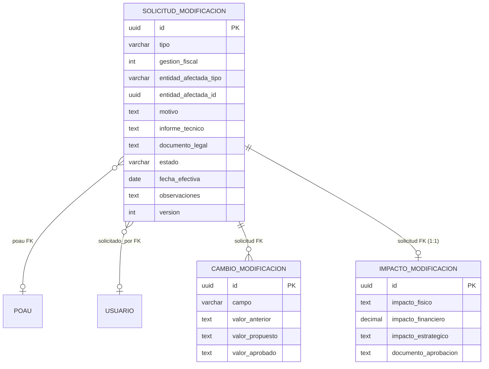
```mermaid
erDiagram
    SOLICITUD_MODIFICACION {
        uuid id PK
        varchar tipo
        int gestion_fiscal
        varchar entidad_afectada_tipo
        uuid entidad_afectada_id
        text motivo
        text informe_tecnico
        text documento_legal
        varchar estado
        date fecha_efectiva
        text observaciones
        int version
    }

    CAMBIO_MODIFICACION {
        uuid id PK
        varchar campo
        text valor_anterior
        text valor_propuesto
        text valor_aprobado
    }

    IMPACTO_MODIFICACION {
        uuid id PK
        text impacto_fisico
        decimal impacto_financiero
        text impacto_estrategico
        text documento_aprobacion
    }

    SOLICITUD_MODIFICACION }o--o| POAU : "poau FK"
    SOLICITUD_MODIFICACION }o--o| USUARIO : "solicitado_por FK"
    SOLICITUD_MODIFICACION ||--o{ CAMBIO_MODIFICACION : "solicitud FK"
    SOLICITUD_MODIFICACION ||--o| IMPACTO_MODIFICACION : "solicitud FK (1:1)"
```

---

## 20. Modulo Notificaciones

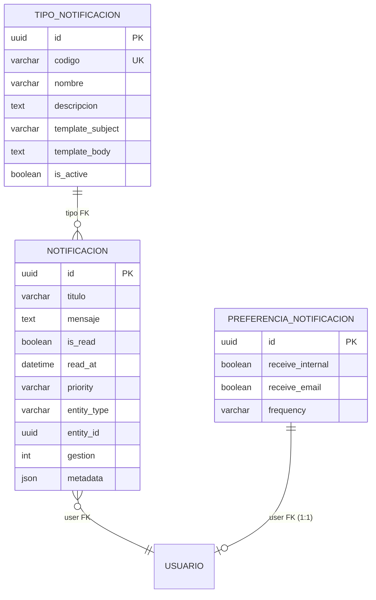
```mermaid
erDiagram
    TIPO_NOTIFICACION {
        uuid id PK
        varchar codigo UK
        varchar nombre
        text descripcion
        varchar template_subject
        text template_body
        boolean is_active
    }

    NOTIFICACION {
        uuid id PK
        varchar titulo
        text mensaje
        boolean is_read
        datetime read_at
        varchar priority
        varchar entity_type
        uuid entity_id
        int gestion
        json metadata
    }

    PREFERENCIA_NOTIFICACION {
        uuid id PK
        boolean receive_internal
        boolean receive_email
        varchar frequency
    }

    TIPO_NOTIFICACION ||--o{ NOTIFICACION : "tipo FK"
    NOTIFICACION }o--|| USUARIO : "user FK"
    PREFERENCIA_NOTIFICACION ||--o| USUARIO : "user FK (1:1)"
```

---

## 21. Modulo Auditoria

```mermaid
erDiagram
    EVENTO_AUDITORIA {
        uuid id PK
        varchar accion
        varchar entidad
        varchar entidad_id
        int version
        text resumen
        json datos_previos
        json datos_posteriores
        ipaddress direccion_ip
        int gestion
        datetime creado_en
    }

    EVENTO_AUDITORIA }o--o| USUARIO : "usuario FK"
```

---

## 22. Modulo Reportes

```mermaid
erDiagram
    REPORTE_GENERADO {
        uuid id PK
        varchar nombre
        varchar tipo
        varchar formato
        file archivo
        varchar hash_archivo
        json parametros
        int gestion
        varchar version_datos
    }

    REPORTE_GENERADO }o--o| USUARIO : "generado_por FK"
```

---

## 23. Modulo Normativa

```mermaid
erDiagram
    VERSION_NORMATIVA {
        uuid id PK
        varchar titulo
        varchar tipo
        varchar numero
        date fecha_emision
        int gestion
        file archivo
        text resumen
    }

    REGLA_PRESUPUESTARIA_LEGAL {
        uuid id PK
        varchar codigo UK
        varchar nombre
        text descripcion
        varchar tipo
        varchar severidad
        text formula
        json parametros
        text condicion_aplicabilidad
        int gestion_desde
        int gestion_hasta
        varchar fuente_normativa
        text mensaje
        int orden
    }

    VERSION_NORMATIVA {
        varchar tipo
    }

    REGLA_PRESUPUESTARIA_LEGAL {
        varchar tipo
        varchar severidad
    }
```

---

## 24. Relaciones Cruzadas Clave entre Modulos

```mermaid
erDiagram
    %% Relaciones entre modulos principales

    ACCION_CORTO_PLAZO ||--o{ POAU_ACTIVIDAD : "actividades_poau FK"
    ACCION_CORTO_PLAZO ||--o{ OPERACION : "operaciones FK"
    ACCION_CORTO_PLAZO ||--o{ PRODUCTO_IND : "productos FK"
    ACCION_CORTO_PLAZO ||--o{ SUPUESTO : "supuestos FK"

    OPERACION ||--o{ LINEA_PRESUPUESTARIA : "lineas_presupuestarias FK"

    POAU_ACTIVIDAD ||--o{ ENTRADA_SEGUIMIENTO : "entradas_seguimiento FK"
    POAU_ACTIVIDAD ||--o{ EJECUCION_FISICA : "ejecucion_fisica FK"
    POAU_ACTIVIDAD ||--o{ EJECUCION_FINANCIERA : "ejecucion_financiera FK"

    %% Documentos adjuntos (polimorfico)
    DOCUMENTO_ADJUNTO }o--o| APROBACION : "aprobaciones FK"

    %% Localizacion territorial (polimorfico)
    LOCALIZACION_TERRITORIAL {
        varchar entidad
        varchar entidad_id
    }

    %% Evaluacion vincula multiples modulos
    RESULTADO_EVALUACION }o--o| POAU : "poau FK"
    RESULTADO_EVALUACION }o--o| RESULTADO_TERRITORIAL : "resultado_pad FK"

    %% POAU articula PAD y Planificacion
    POAU }o--o| PRODUCTO_TERRITORIAL : "producto_territorial FK"
    POAU_ACTIVIDAD }o--o| ACCION_CORTO_PLAZO : "accion_corto_plazo FK"

    %% Seguimiento vincula POAU y Alertas con Acciones Correctivas
    ENTRADA_SEGUIMIENTO ||--o{ ACCION_CORRECTIVA : "acciones_correctivas FK"
    ALERTA ||--o{ ACCION_CORRECTIVA : "acciones_correctivas FK"

    %% Modificaciones afectan POAU
    SOLICITUD_MODIFICACION }o--o| POAU : "poau FK"
```

---

## Resumen de Relaciones por Tipo

### Foreign Keys Principales

| Origen | Destino | Campo | Tipo |
|--------|---------|-------|------|
| Usuario | Rol | roles | M2M |
| UnidadOrganizacional | UnidadOrganizacional | padre | Self FK |
| UnidadOrganizacional | TipoUnidad | tipo | FK |
| UnidadOrganizacional | Usuario | responsable | FK |
| DireccionAdministrativa | Usuario | responsable | FK |
| UnidadEjecutora | DireccionAdministrativa | da | FK |
| UnidadEjecutora | UnidadOrganizacional | unidad_organizacional | FK |
| Plan | (N/A) | tipo, codigo | UK |
| NodoPlanificacion | Plan | plan | FK |
| NodoPlanificacion | NodoPlanificacion | padre | Self FK |
| AccionMedianoPlazo | NodoPlanificacion | nodo_planificacion | FK |
| AccionCortoPlazo | AccionMedianoPlazo | accion_mediano_plazo | FK |
| AccionCortoPlazo | UnidadOrganizacional | unidad_responsable | FK |
| Indicador | UnidadMedida | unidad_medida | FK |
| MetaProgramada | Indicador | indicador | FK |
| Operacion | AccionCortoPlazo | accion_corto_plazo | FK |
| Tarea | Operacion | operacion | FK |
| Producto (indicadores) | AccionCortoPlazo | accion_corto_plazo | FK |
| EstimacionRecurso | RubroRecurso | rubro | FK |
| EstimacionRecurso | FuenteFinanciamiento | fuente | FK |
| EstimacionPlurianual | EstimacionRecurso | estimacion_origen | FK |
| TechoPresupuestario | FuenteFinanciamiento | fuente | FK |
| DistribucionTecho | TechoPresupuestario | techo | FK |
| DistribucionTecho | UnidadOrganizacional | unidad | FK |
| LineaPresupuestaria | ProgramaPresupuestario | programa | FK |
| LineaPresupuestaria | ObjetoGasto | objeto_gasto | FK |
| LineaPresupuestaria | FuenteFinanciamiento | fuente | FK |
| LineaPresupuestaria | Operacion | operacion | FK |
| ProyectoInversion | UnidadEjecutora | ue | FK |
| ProyectoInversion | ProgramaPresupuestario | programa | FK |
| POAU | UnidadOrganizacional | unidad | FK |
| POAU | ProductoTerritorial | producto_territorial | FK |
| POAUActividad | POAU | poau | FK |
| POAUActividad | ObjetoGasto | objeto_gasto | FK |
| POAUActividad | AccionCortoPlazo | accion_corto_plazo | FK |
| PoliticaPAD | (N/A) | codigo, gestion | UK |
| LineamientoEstrategico | PoliticaPAD | politica | FK |
| ResultadoTerritorial | LineamientoEstrategico | lineamiento | FK |
| ResultadoTerritorial | SectorPAD | sector | FK |
| ProductoTerritorial | ResultadoTerritorial | resultado | FK |
| ProgramacionAnualPAD | ResultadoTerritorial | resultado | FK |
| ProgramacionAnualPAD | ProductoTerritorial | producto | FK |
| ArticulacionSIPEB | ResultadoTerritorial | resultado | FK (1:1) |
| EnvioFormulacion | UnidadOrganizacional | unidad | FK |
| Revision | EnvioFormulacion | envio | FK |
| Observacion | Revision | revision | FK |
| Aprobacion | DocumentoAdjunto | documento | FK |
| Evaluacion | Plan | plan | FK |
| CriterioEvaluacion | Evaluacion | evaluacion | FK |
| ResultadoEvaluacion | Evaluacion | evaluacion | FK |
| ResultadoEvaluacion | POAU | poau | FK |
| ResultadoEvaluacion | ResultadoTerritorial | resultado_pad | FK |
| ReporteSeguimiento | UnidadOrganizacional | unidad_organizacional | FK |
| EntradaSeguimiento | ReporteSeguimiento | reporte | FK |
| EntradaSeguimiento | POAUActividad | actividad | FK |
| Alerta | EntradaSeguimiento | entrada | FK |
| AccionCorrectiva | Alerta | alerta | FK |
| AccionCorrectiva | EntradaSeguimiento | entry | FK |
| CompromisoAccionCorrectiva | AccionCorrectiva | accion_correctiva | FK |
| SolicitudModificacion | POAU | poau | FK |
| CambioModificacion | SolicitudModificacion | solicitud | FK |
| ImpactoModificacion | SolicitudModificacion | solicitud | FK (1:1) |
| Notificacion | TipoNotificacion | tipo | FK |
| Notificacion | Usuario | user | FK |
| PreferenciaNotificacion | Usuario | user | FK (1:1) |
| ReporteGenerado | Usuario | generado_por | FK |

### Relaciones OneToOne

| Modelo A | Modelo B | Campo |
|----------|----------|-------|
| ArticulacionSIPEB | ResultadoTerritorial | resultado |
| ImpactoModificacion | SolicitudModificacion | solicitud |
| PreferenciaNotificacion | Usuario | user |

### Relaciones ManyToMany

| Modelo A | Modelo B | Intermedia |
|----------|----------|-----------|
| Usuario | Rol | (directa) |
