# Modelo de Datos — SISPAD–PEI–POA

> **Fase 0**: Documento generado como parte del análisis inicial del proyecto.
> **Fecha**: 2026-07-16

---

## 1. Modelo Entidad-Relación (Mermaid)

```mermaid
erDiagram
    Institution ||--o{ OrganizationalUnit : "tiene"
    OrganizationalUnit ||--o{ OrganizationalUnit : "padre-hijo"
    OrganizationalUnit ||--o{ POAU : "formula"
    OrganizationalUnit ||--o{ UserAssignment : "asigna"
    OrganizationalUnit ||--o{ BudgetCeilingDistribution : "recibe"

    User ||--o{ UserAssignment : "asignado a"
    User ||--o{ Rol : "tiene"
    User ||--o{ AuditEvent : "genera"

    FiscalYear ||--o{ FormulationCycle : "contiene"
    FiscalYear ||--o{ BudgetCeiling : "define"
    FormulationCycle ||--o{ FormulationStage : "tiene etapas"

    Plan ||--o{ PlanVersion : "versiona"
    PlanVersion ||--o{ StrategicNode : "contiene"
    StrategicNode ||--o{ StrategicNode : "padre-hijo"
    StrategicNode ||--o{ ArticulationLink : "origen"
    StrategicNode ||--o{ ArticulationLink : "destino"

    Plan ||--o{ MediumTermAction : "define"
    MediumTermAction ||--o{ ShortTermAction : "despliega"
    ShortTermAction ||--o{ Operation : "compone"
    Operation ||--o{ Activity : "compone"
    Activity ||--o{ Task : "descompone"

    BudgetCeiling ||--o{ BudgetCeilingDistribution : "distribuye"
    BudgetCeilingDistribution ||--o{ BudgetLine : "limita"

    POAU ||--o{ POAUActivity : "tiene"
    POAUActivity ||--o{ PhysicalExecution : "mide"
    POAUActivity ||--o{ FinancialExecution : "mide"
    POAUActivity ||--o{ BudgetLine : "financia"

    BudgetLine }o--|| Program : "clasifica"
    BudgetLine }o--|| FundingSource : "clasifica"
    BudgetLine }o--|| ExpenseObject : "clasifica"
    BudgetLine }o--|| FinancingOrganization : "clasifica"

    Indicator ||--o{ IndicatorBaseline : "tiene"
    Indicator ||--o{ IndicatorTarget : "define"
    Indicator ||--o{ IndicatorMeasurement : "mide"
    Indicator ||--o{ VerificationMethod : "verifica"

    InvestmentProject ||--o{ MultiYearProjection : "programa"
    InvestmentProject ||--o{ TerritoryLocation : "localiza"

    TerritoryUnit ||--o{ TerritoryUnit : "padre-hijo"
    TerritoryUnit ||--o{ TerritoryLocation : "ubica"
    Project ||--o{ TerritoryLocation : "territorializa"

    Document ||--o{ DocumentVersion : "versiona"
    Document ||--o{ Approval : "respalda"

    Approval ||--o{ ApprovalObservation : "observa"
    Submission ||--o{ Review : "revisa"
    Review ||--o{ Observation : "detecta"

    AmendmentRequest ||--o{ AmendmentChange : "modifica"
```



## 2. Diagrama de Entidades por App

### 2.1 Core (Base abstracta)

```
TimeStampedModel (abstract)
├── created_at: DateTime (auto)
├── updated_at: DateTime (auto)
├── created_by: FK → User
└── updated_by: FK → User

UUIDModel (abstract)
└── id: UUID (PK)

ActivableModel (abstract)
└── activo: Boolean

VigenciaModel (abstract)
├── fecha_vigencia_desde: Date
└── fecha_vigencia_hasta: Date (nullable)

VersionableModel (abstract)
├── version: PositiveInteger
└── gestion: PositiveInteger
```

### 2.2 Accounts (Usuarios y Roles)

```
Rol
├── id: UUID (PK)
├── codigo: Char(50) (unique)
├── nombre: Char(200)
├── descripcion: Text
├── es_sistema: Boolean
├── activo: Boolean
└── orden: PositiveInteger

Usuario (AbstractUser)
├── id: UUID (PK)
├── email: EmailField (unique, USERNAME_FIELD)
├── password: Char (heredado)
├── cargo: Char(200)
├── telefono: Char(50)
├── roles: M2M → Rol
├── debe_cambiar_password: Boolean
└── activo: Boolean
```

### 2.3 Organización

```
TipoUnidad
├── id: UUID (PK)
├── codigo: Char(20) (unique)
├── nombre: Char(200)
├── nivel: PositiveInteger
└── activo: Boolean

UnidadOrganizacional
├── id: UUID (PK)
├── codigo: Char(20)
├── nombre: Char(300)
├── sigla: Char(30)
├── tipo: FK → TipoUnidad
├── padre: FK → self (nullable)
├── responsable: FK → Usuario (nullable)
├── gestion: PositiveInteger
├── orden: PositiveInteger
└── (hereda TimeStamped, Activable, Vigencia)

DireccionAdministrativa
├── id: UUID (PK)
├── codigo: Char(10)
├── nombre: Char(200)
├── gestion: PositiveInteger
├── responsable: FK → Usuario
└── (hereda TimeStamped, Activable, Vigencia)

UnidadEjecutora
├── id: UUID (PK)
├── codigo: Char(10)
├── nombre: Char(200)
├── da: FK → DireccionAdministrativa
├── unidad_organizacional: FK → UnidadOrganizacional (nullable)
├── gestion: PositiveInteger
├── responsable: FK → Usuario
└── (hereda TimeStamped, Activable, Vigencia)

AsignacionUsuarioUnidad
├── id: UUID (PK)
├── usuario: FK → Usuario
├── unidad: FK → UnidadOrganizacional
├── es_responsable_poa: Boolean
├── gestion: PositiveInteger
├── activo: Boolean
└── (hereda TimeStamped)
```

### 2.4 Gestión Fiscal

```
GestionFiscal
├── id: UUID (PK)
├── anio: PositiveInteger (unique)
├── estado: Char (preparacion → archivada)
├── descripcion: Text
├── anio_inicio_plurianual: PositiveInteger
├── anio_fin_plurianual: PositiveInteger
├── fecha_apertura: DateTime
├── fecha_cierre: DateTime
├── activa: Boolean
├── creado_por: FK → Usuario
├── creado_en: DateTime
└── actualizado_en: DateTime

CicloFormulacion
├── id: UUID (PK)
├── gestion: FK → GestionFiscal
├── nombre: Char(200)
├── descripcion: Text
├── fecha_inicio: DateTime
├── fecha_cierre: DateTime
├── fecha_cierre_prorroga: DateTime
├── activo: Boolean
├── orden: PositiveInteger
└── (TimeStamped)

EtapaFormulacion
├── id: UUID (PK)
├── ciclo: FK → CicloFormulacion
├── codigo: Char(50)
├── nombre: Char(200)
├── descripcion: Text
├── fecha_inicio: DateTime
├── fecha_cierre: DateTime
├── completada: Boolean
└── orden: PositiveInteger
```

### 2.5 Catálogos

```
CatalogoBase (abstract)
├── id: UUID (PK)
├── codigo: Char(50)
├── denominacion: Char(500)
├── descripcion: Text
├── gestion: PositiveInteger
├── fuente_normativa: Char(500)
├── metadatos_importacion: JSON
└── (hereda TimeStamped, Activable, Vigencia)

Models concretos: ClasificadorInstitucional, RubroRecurso, ObjetoGasto,
FuenteFinanciamiento, OrganismoFinanciador, EntidadTransferencia,
FinalidadFuncion, UnidadMedida, TipoOperacion, TipoProducto,
TipoProyecto, TipoFinanciamiento

VersionCatalogo
├── id: UUID (PK)
├── nombre: Char(200)
├── gestion: PositiveInteger
├── archivo: FileField
├── aplicado: Boolean
├── fecha_aplicacion: DateTime
└── creado_en: DateTime
```

### 2.6 Planificación

```
Plan
├── id: UUID (PK)
├── codigo: Char(50)
├── nombre: Char(500)
├── tipo: Char (pdes, ptdi, pei, sectorial, municipal, otro)
├── gestion_inicio: PositiveInteger
├── gestion_fin: PositiveInteger
├── descripcion: Text
└── (hereda TimeStamped, Activable, Vigencia)

NodoPlanificacion
├── id: UUID (PK)
├── plan: FK → Plan
├── padre: FK → self (nullable)
├── nivel: Char (pilar, eje, meta, resultado, accion_nacional, accion_pdes, accion_mediano, accion_corto, operacion, tarea)
├── codigo: Char(50)
├── nombre: Text
├── descripcion: Text
├── gestion: PositiveInteger
└── orden: PositiveInteger

ArticulacionPlanificacion
├── id: UUID (PK)
├── nodo_origen: FK → NodoPlanificacion
├── nodo_destino: FK → NodoPlanificacion
├── es_principal: Boolean
└── gestion: PositiveInteger

AccionMedianoPlazo
├── id: UUID (PK)
├── codigo: Char(50)
├── nombre: Text
├── descripcion: Text
├── nodo_planificacion: FK → NodoPlanificacion
├── gestion_inicio: PositiveInteger
├── gestion_fin: PositiveInteger
├── responsable: FK → Usuario
└── (hereda TimeStamped, Activable)

AccionCortoPlazo
├── id: UUID (PK)
├── codigo: Char(50)
├── nombre: Text
├── descripcion: Text
├── justificacion: Text
├── accion_mediano_plazo: FK → AccionMedianoPlazo
├── unidad_responsable: FK → UnidadOrganizacional
├── gestion: PositiveInteger
├── fecha_inicio: Date
├── fecha_fin: Date
└── (hereda TimeStamped, Activable)
```

### 2.7 PAD

```
SectorPAD
├── codigo: Char(10) (unique)
└── nombre: Char(200)

PoliticaPAD
├── codigo: Char(20)
├── nombre: Char(500)
├── descripcion: Text
└── gestion: PositiveInteger

LineamientoEstrategico
├── codigo: Char(20)
├── nombre: Char(500)
├── politica: FK → PoliticaPAD
└── gestion: PositiveInteger

ResultadoTerritorial
├── codigo: Char(50)
├── nombre: Text
├── lineamiento: FK → LineamientoEstrategico
├── sector: FK → SectorPAD
├── indicador: Text
├── formula: Text
├── linea_base: Decimal
├── meta_2030: Decimal
├── programacion_fisica: JSON
├── programacion_financiera: JSON
├── gestion: PositiveInteger
└── estado: Char (borrador, enviado, aprobado, rechazado)

ProductoTerritorial
├── codigo: Char(50)
├── nombre: Text
├── resultado: FK → ResultadoTerritorial
├── territorializacion: Text
├── responsable: Char(300)
├── indicador: Text
├── formula: Text
├── linea_base: Decimal
├── meta_2030: Decimal
├── programacion_fisica: JSON
├── programacion_financiera: JSON
└── gestion: PositiveInteger

ArticulacionSIPEB
├── resultado: OneToOne → ResultadoTerritorial
├── cod_eje_pgdesa: Char(20)
├── objetivo_impacto_pgdesa: Text
├── cod_componente_pdesa: Char(20)
├── objetivo_efecto_pdesa: Text
├── cod_ods: Char(10)
├── cod_meta_ndc: Char(10)
├── cod_principio_ndt: Char(10)
├── compromisos_3030: Text
├── cod_sector: Char(10)
├── sector_nombre: Char(200)
├── cod_resultado_pds: Char(20)
├── resultado_pds: Text
├── cod_geografico: Char(20)
├── denominacion_eta: Char(300)
└── gestion: PositiveInteger
```

### 2.8 POAU

```
POAU
├── unidad: FK → UnidadOrganizacional
├── producto_territorial: FK → ProductoTerritorial
├── gestion: PositiveInteger
├── codigo: Char(50) (unique)
├── nombre: Text
├── descripcion: Text
├── estado: Char (borrador, enviado, aprobado, rechazado)
├── responsable: FK → Usuario
├── created_at: DateTime
└── updated_at: DateTime

POAUActividad
├── poau: FK → POAU
├── codigo: Char(50)
├── nombre: Text
├── objeto_gasto: FK → ObjetoGasto
├── meta_fisica_anual: Decimal
├── presupuesto_anual: Decimal
└── (unique: poau + codigo)

EjecucionFisica
├── actividad: FK → POAUActividad
├── periodo: Char(20)
├── tipo_periodo: Char (mensual, trimestral, semestral, anual)
├── programado: Decimal
├── ejecutado: Decimal
└── observaciones: Text

EjecucionFinanciera
├── actividad: FK → POAUActividad
├── periodo: Char(20)
├── tipo_periodo: Char (mensual, trimestral, semestral, anual)
├── programado: Decimal
├── ejecutado: Decimal
└── observaciones: Text
```

### 2.9 Techos Presupuestarios

```
TechoPresupuestario
├── gestion: PositiveInteger
├── monto_total: Decimal (≥0)
├── fuente: FK → FuenteFinanciamiento
├── organismo: FK → OrganismoFinanciador
├── descripcion: Text
├── activo: Boolean
└── version: PositiveInteger

DistribucionTecho
├── techo: FK → TechoPresupuestario
├── da: FK → DireccionAdministrativa
├── ue: FK → UnidadEjecutora
├── unidad: FK → UnidadOrganizacional
├── programa: FK → ProgramaPresupuestario
├── monto_asignado: Decimal (≥0)
├── monto_reserva: Decimal
├── activo: Boolean
└── version: PositiveInteger
```

### 2.10 Presupuesto

```
ProgramaPresupuestario → ProyectoPresupuestario → ActividadPresupuestaria
(Cadena programática jerárquica)

LineaPresupuestaria
├── gestion: PositiveInteger
├── entidad: Char(20)
├── da: FK → DireccionAdministrativa
├── ue: FK → UnidadEjecutora
├── programa: FK → ProgramaPresupuestario
├── proyecto: FK → ProyectoPresupuestario
├── actividad: FK → ActividadPresupuestaria
├── finalidad_funcion: FK → FinalidadFuncion
├── fuente: FK → FuenteFinanciamiento
├── organismo: FK → OrganismoFinanciador
├── objeto_gasto: FK → ObjetoGasto
├── entidad_transferencia: FK → EntidadTransferencia
├── importe: Decimal (≥0)
├── importe_plurianual: Decimal
├── importe_gestion_anterior: Decimal
├── operacion: FK → Operacion
├── version: PositiveInteger
└── activo: Boolean
```

### 2.11 Workflow

```
EnvioFormulacion → Revision → Observacion
                                  ↓
                             Aprobacion
```

### 2.12 Auditoría

```
EventoAuditoria
├── usuario: FK → Usuario
├── accion: Char (login, logout, crear, modificar, anular, enviar, aprobar, etc.)
├── entidad: Char(100)
├── entidad_id: Char(100)
├── version: PositiveInteger
├── resumen: Text
├── datos_previos: JSON
├── datos_posteriores: JSON
├── direccion_ip: GenericIP
├── gestion: PositiveInteger
└── creado_en: DateTime
```

## 3. Modelos Propuestos (Nuevos — Pendientes de Implementar)

| Entidad | App destino | Descripción |
|---------|-------------|-------------|
| PlanVersion | planificacion | Versionado de planes con inmutabilidad |
| Institution | organizacion | Entidad multisitio para multitenant |
| ProgramacionAnual | planificacion | Normalización de JSONField a tabla |
| AmendmentRequest | Nuevo (amendments) | Solicitud de modificación |
| AmendmentChange | Nuevo (amendments) | Cambio individual en una modificación |
| CorrectiveAction | Nuevo (tracking) | Acción correctiva por desviación |
| TrackingReport | Nuevo (tracking) | Reporte de seguimiento periódico |
| TrackingEntry | Nuevo (tracking) | Entrada individual de seguimiento |
| Evaluation | Nuevo (evaluation) | Evaluación de plan/periodo |
| EvaluationCriterion | Nuevo (evaluation) | Criterio de evaluación |
| EvaluationResult | Nuevo (evaluation) | Resultado de evaluación |
| LessonLearned | Nuevo (evaluation) | Lección aprendida |
| Recommendation | Nuevo (evaluation) | Recomendación |
| Notification | Nuevo (notifications) | Notificación interna |
| PublicPortalConfig | Nuevo (public-portal) | Configuración del portal público |
| AuxiliarPluri | Nuevo (reporting) | Reporte plurianual de presupuesto |
