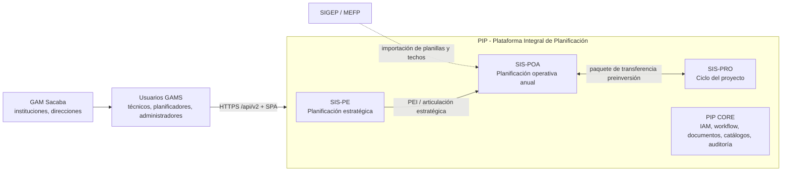
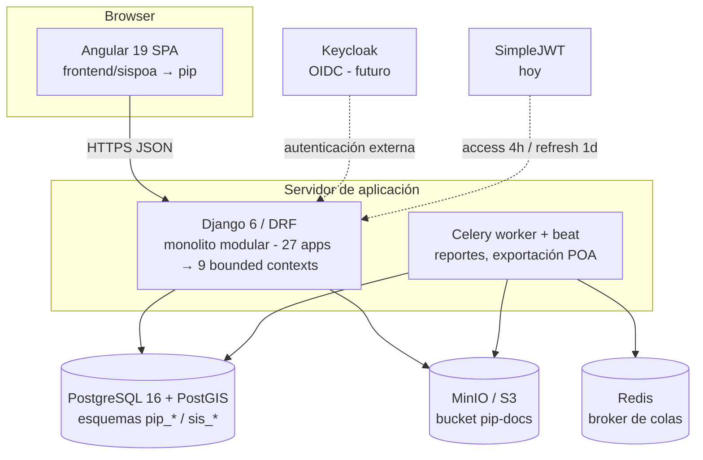
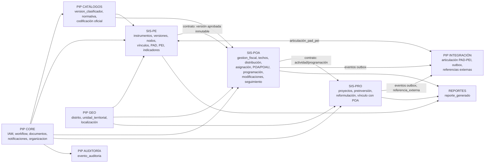
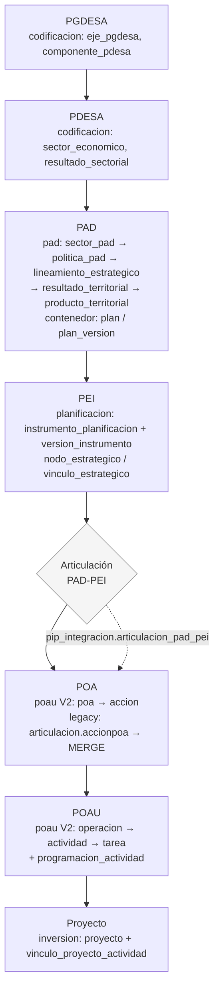
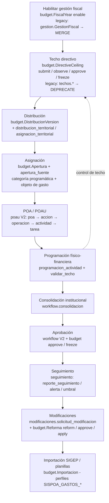

# FASE 2 — ARQUITECTURA OBJETIVO (PIP-GAMS)

> Arquitectura destino de la Plataforma Integral de Planificación del GAM Sacaba, resultado del refactor SISPOA → PIP.
> Fuentes: `AUDITORIA_SISPOA.md`, `ARQUITECTURA_ACTUAL.md`, `DOMAIN_MAP.md`, `SCHEMA_MAPPING.md` y `PLAN_MAESTRO_REFAC_PIP_GAMS.md`.
> Este documento define el objetivo; los esquemas físicos se migran en fases posteriores con el plan de datos (`DATA_MIGRATION_PLAN.md`).

---

## 1. Visión general

PIP es la plataforma raíz. Sobre un núcleo transversal compartido (PIP CORE) viven tres subsistemas funcionales — SIS-PE (planificación estratégica), SIS-POA (planificación operativa anual) y SIS-PRO (ciclo del proyecto) — más los soportes transversales de catálogos, integración, auditoría, geo y reportes. Es un monolito modular Django sobre una única base PostgreSQL 16/PostGIS, con frontend Angular y almacenamiento de objetos MinIO.

| Dimensión | Decisión | Evidencia |
|---|---|---|
| Identidad | PIP = plataforma; SIS-PE/SIS-POA/SIS-PRO = subsistemas | `AUDITORIA_SISPOA.md` §2, `DOMAIN_MAP.md` |
| Estilo | Monolito modular (alta cohesión por app, bajo acoplamiento, integridad transaccional) | Plan maestro §3.16, ADR-009 |
| Datos | Una sola base PostgreSQL 16 + PostGIS 3.4; 8 esquemas objetivo | `ARQUITECTURA_ACTUAL.md` §1, ADR-003 |
| API | `/api/v2/{platform,sis-pe,sis-poa,sis-poa/budget,sis-pro,me}`; V1 temporal | `ARQUITECTURA_ACTUAL.md` §5, ADR-002 |
| Autenticación | SimpleJWT hoy; OIDC/Keycloak futuro (conviven) | `ARQUITECTURA_ACTUAL.md` §6 |
| Almacenamiento | MinIO (S3) con bucket objetivo `pip-docs`; FileSystemStorage local como fallback | `settings_storage.py`, auditoría §3.4 |

## 2. Principios de la arquitectura objetivo

1. **Monolito modular**: una app Django por bounded context, integridad transaccional dentro del proceso, sin microservicios en esta etapa (plan maestro §3.16).
2. **Trazabilidad**: auditoría append-only transversal (`pip_auditoria.evento_auditoria`) para eventos relevantes; snapshots JSON de antes/después; versiones aprobadas inmutables con checksum.
3. **Multigestión**: `GestionFiscal`/`FiscalYear` transversal; ninguna referencia hardcodeada a una gestión concreta (p. ej. 2027); toda tabla dependiente de gestión con FK a la gestión.
4. **Multinstrumento**: instrumentos y metodologías parametrizables (`TipoInstrumento`, `VersionMetodologia`); niveles de nodo configurables, no `NIVEL_CHOICES` fijos en Python.
5. **RBAC combinado**: SimpleJWT (hoy) + capacidades atómicas `sistema.dominio.accion` agrupadas en roles, con alcance organizacional; backend como autoridad de permisos; menú frontend derivado de `/api/v2/me/capabilities`.
6. **Eventos de dominio internos**: comunicación entre bounded contexts por contrato (servicios de dominio + outbox `pip_integracion.evento_outbox`), sin Kafka/RabbitMQ en esta etapa.
7. **Integridad referencial real**: relaciones de negocio con FK reales y tablas de articulación tipadas; prohibido el patrón genérico `source_type` + `source_id` para relaciones críticas (ADR-004).
8. **Una sola fuente de verdad**: prohibido duplicar estructuras PAD/PEI/POA entre apps (plan maestro §3.1-3.2).
9. **Refactor incremental**: preservar → normalizar → versionar → migrar → validar → cortar → retirar (plan maestro §32).

## 3. Context Diagram (C4)

## 4. Container Diagram

## 5. Domain Diagram (bounded contexts)

Dependencias entre dominios: SIS-PE → SIS-POA → SIS-PRO por contrato (IDs + versiones), nunca por acceso directo a internals. PIP CORE es la base de todos.

Nota: la app actual `articulacion` se SPLIT en tres destinos (estratégico → SIS-PE, operativo → SIS-POA, cadena → PIP INTEGRACIÓN), según `DOMAIN_MAP.md` §4. `inversion` entrega sus artefactos de integración (`evento_outbox`, `mensaje_entrante`, `referencia_externa`) a PIP INTEGRACIÓN (`SCHEMA_MAPPING.md` §6).

## 6. Reglas de dependencia

| Regla | Descripción |
|---|---|
| R1 | SIS-PRO no accede a internals de SIS-POA; solo consume el contrato público (IDs de actividad, programación, techo) vía servicios de dominio o vínculos tipados (`vinculo_proyecto_actividad`). |
| R2 | SIS-POA lee del SIS-PE exclusivamente versiones aprobadas e inmutables (`version_instrumento`, checksum); nunca tablas de borrador. |
| R3 | La comunicación entre bounded contexts usa servicios de dominio y eventos internos (patrón outbox), no queries directas entre apps. |
| R4 | Los catálogos maestros se leen de PIP CATÁLOGOS; está prohibido que un SIS mantenga su propia copia editable de un catálogo. |
| R5 | La integración con sistemas externos (SIGEP/MEFP, SIS-PRO↔SIS-POA) pasa por PIP INTEGRACIÓN; ninguna app emite paquetes de integración por su cuenta. |
| R6 | Auditoría y eventos son transversales: los eventos relevantes se registran en `pip_auditoria.evento_auditoria` y/o `pip_integracion.evento_outbox`, no en tablas de dominio. |
| R7 | Las dependencias entre esquemas se resuelven por FK y `search_path` explícito; los privilegios se otorgan por esquema (ver `DATA_MIGRATION_PLAN.md` §6). |

## 7. Database Schema Diagram

Distribución de las 217 tablas actuales hacia los esquemas objetivo (`SCHEMA_MAPPING.md`). Se muestran las tablas principales por esquema.

```mermaid
erDiagram
    pip_core_cuentas_usuario ||--o{ pip_core_cuentas_rol : "roles"
    pip_core_cuentas_rol ||--o{ pip_core_cuentas_capacidad : "capacidades"
    pip_core_unidadorganizacional ||--o{ pip_core_cuentas_usuario : "alcance"

    pip_core_flujo_definicion ||--o{ pip_core_flujo_instancia : "instancia"
    pip_core_flujo_instancia ||--o{ pip_core_flujo_tarea : "tareas"

    pip_catalogo_version_clasificador ||--o{ pip_catalogo_objeto_gasto : "versión"
    pip_catalogo_version_clasificador ||--o{ pip_catalogo_fuente_financiamiento : "versión"

    sis_pe_plan ||--o{ sis_pe_plan_version : "versiones"
    sis_pe_plan_version ||--o{ sis_pe_instrumento_planificacion : "instrumento"
    sis_pe_instrumento_planificacion ||--o{ sis_pe_version_instrumento : "versiones aprobadas"
    sis_pe_version_instrumento ||--o{ sis_pe_nodo_planificacion : "nodos"
    sis_pe_nodo_planificacion ||--o{ sis_pe_vinculo_estrategico : "vínculos"
    sis_pe_plan ||--o{ sis_pe_sector_pad : "PAD"
    sis_pe_sector_pad ||--o{ sis_pe_lineamiento_estrategico : "lineamientos"
    sis_pe_lineamiento_estrategico ||--o{ sis_pe_resultado_territorial : "resultados"
    sis_pe_resultado_territorial ||--o{ sis_pe_producto_territorial : "productos"
    sis_pe_producto_territorial ||--o{ sis_pe_programacion_anual_pad : "programación"

    sis_poa_gestion_fiscal ||--o{ sis_poa_techo_directivo : "gestión"
    sis_poa_techo_directivo ||--o{ sis_poa_distribucion_version : "distribuye"
    sis_poa_distribucion_version ||--o{ sis_poa_apertura : "asigna"
    sis_poa_apertura ||--o{ sis_poa_apertura_fuente : "fuentes"
    sis_poa_categoria_programatica ||--o{ sis_poa_apertura : "clasifica"
    sis_poa_operacion ||--o{ sis_poa_actividad : "operación"
    sis_poa_actividad ||--o{ sis_poa_tarea : "actividad"
    sis_poa_tarea ||--o{ sis_poa_programacion_actividad : "programación"
    sis_poa_apertura ||--o{ sis_poa_reforma : "reformas"
    sis_poa_reforma ||--o{ sis_poa_reforma_movimiento : "movimientos"

    sis_pro_proyecto ||--o{ sis_pro_proyecto_inversion : "cartera"
    sis_pro_proyecto ||--o{ sis_pro_itcp : "preinversión"
    sis_pro_proyecto ||--o{ sis_pro_tdr : "preinversión"
    sis_pro_proyecto ||--o{ sis_pro_edtp : "preinversión"
    sis_pro_proyecto ||--o{ sis_pro_vinculo_proyecto_actividad : "vínculo POA"
    sis_pro_proyecto ||--o{ sis_pro_revision_preinversion : "revisiones"
```

| Esquema | Contenido | Tablas (principales) |
|---|---|---|
| `pip_core` | IAM, organización, workflow, documentos, notificaciones, acciones correctivas | `cuentas_usuario`, `cuentas_rol`, `cuentas_capacidad`, `unidadorganizacional`, `flujo_definicion`, `flujo_instancia`, `documento_adjunto`, `notificacion` |
| `pip_catalogo` | Catálogos normativos versionados, normativa, codificación | `version_clasificador`, `objeto_gasto`, `fuente_financiamiento`, `version_normativa`, `version_catalogo_plan` |
| `sis_pe` | Plan, PAD, PEI, nodos, vínculos, indicadores estratégicos | `plan`, `plan_version`, `instrumento_planificacion`, `version_instrumento`, `nodo_planificacion`, `sector_pad`, `lineamiento_estrategico`, `resultado_territorial`, `producto_territorial`, `programacion_anual_pad` |
| `sis_poa` | Gestión fiscal, techos, distribución, asignación, POA/POAU, programación, reformas, modificaciones, seguimiento | `gestion_fiscal`, `techo_directivo`, `distribucion_version`, `apertura`, `apertura_fuente`, `categoria_programatica`, `poa_institucional`, `operacion`, `actividad`, `tarea`, `programacion_actividad`, `reforma`, `reforma_movimiento`, `importacion`, `solicitud_modificacion`, `reporte_seguimiento` |
| `sis_pro` | Proyectos, preinversión (ITCP/TDR/EDTP), reformulación | `proyecto`, `proyecto_inversion`, `itcp`, `tdr`, `edtp`, `vinculo_proyecto_actividad`, `solicitud_reformulacion`, `revision_preinversion` |
| `pip_integracion` | Articulación PAD-PEI, outbox, mensajes entrantes, referencias externas | `articulacion_pad_pei`, `evento_outbox`, `mensaje_entrante`, `referencia_externa` |
| `pip_auditoria` | Trazabilidad transversal | `evento_auditoria` |
| `pip_geo` | Base geográfica | `distrito`, `unidad_territorial`, `localizacion_territorial`, `entidad_territorial_cgeo` |
| `reportes` | Generación de reportes | `reporte_generado` |

## 8. Flow PAD → PEI → POA → POAU

Regla: el SIS-POA lee desde versiones aprobadas inmutables del kernel estratégico (`version_instrumento`, checksum SHA-256); el SIS-PRO vincula proyectos a actividades del POA vía `vinculo_proyecto_actividad` (contrato explícito, `DOMAIN_MAP.md` §2).

## 9. Flow Techo → Distribución → Asignación → Programación

Ciclo presupuestario SIS-POA completo (fases 1-12 de `DOMAIN_MAP.md` §3), centrado en el encadenamiento techo-distribución-asignación-programación:

## 10. Migración física de esquemas

- Los esquemas `pip_core`, `pip_catalogo`, `sis_pe`, `sis_poa`, `sis_pro`, `pip_integracion`, `pip_auditoria`, `pip_geo` se crean y pueblan por fases en el plan de datos (`DATA_MIGRATION_PLAN.md`), con backup previo y validación por grupo.
- El esquema `public` queda como legacy (`public_legacy`) hasta completar el cutover y la ventana de observación; NUNCA se ejecuta `DROP SCHEMA ... CASCADE` al inicio.
- La app legacy `presupuesto` (6 tablas) y `techos` (3 tablas) se DEPRECATE a favor de `budget` V2; la colisión de prefijos `presupuesto_categoria_programatica` vs `presupuesto_categoriaprogramatica` se resuelve con la separación de esquemas (ver `SCHEMA_MAPPING.md` §10.1).
- Tablas de framework/PostGIS (`auth_*`, `django_*`, `geometry_columns`, `spatial_ref_sys`) permanecen en `public` (KEEP_SYSTEM).

## 11. Migración a corto plazo de la identidad visible

Según `AUDITORIA_SISPOA.md` §6 (fase 2 de ejecución), los cambios de identidad visible — login, título, marca del sidebar, header, Django admin, email de reset, Swagger y endpoint raíz — se ejecutan antes que los cambios estructurales. El `tokenKey: 'sispoa_token'` se renombra SOLO con estrategia de migración de sesión, y los valores de datos protegidos (`PerfilImportacion.SISPOA_GASTOS_*`, `sistema_origen='SISPOA'`) se mantienen con coexistencia hasta la fase de datos.
